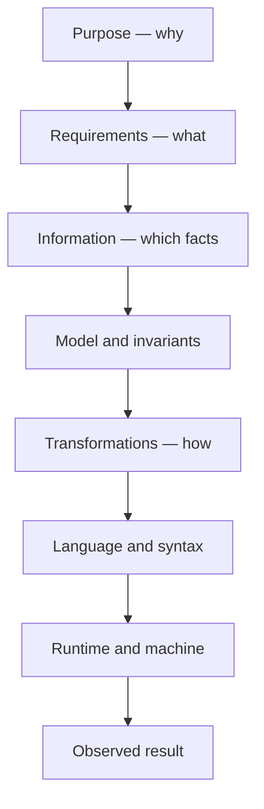
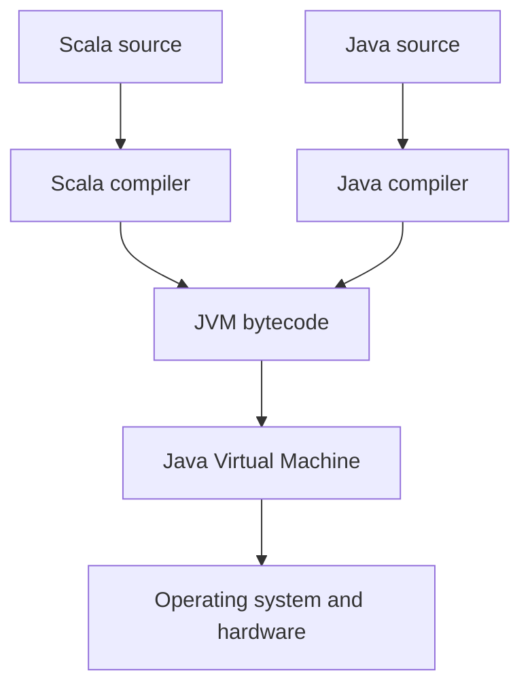
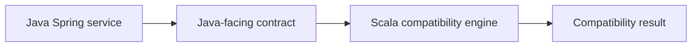

# Scala Through the Information Hierarchy 🧭

## From system pressure to syntax — using Cooked-App

> Scala should arrive as an answer before it appears as syntax.

Scala is not a different computing universe from Java. It is another language for expressing programs on the JVM—one designed to combine object-oriented modelling with functional transformation.

The central idea is simple:

> **A Scala program is typed information flowing through controlled transformations.**

By the end of this lesson, you should be able to explain:

- Why Scala exists.
- Where it sits in the software stack.
- How it combines object-oriented and functional programming.
- Why `val`, functions, case classes, `Option` and pattern matching belong together.
- How Java and Scala can coexist inside Cooked-App.
- Why a small Scala compatibility engine should remain a module—not become a microservice.

---

## 1. Start at the top: why does Scala exist? 🌍

Software begins with a human purpose, not a programming language.

A business wants to answer questions such as:

- Which restaurant meals suit this customer?
- Which meals violate an allergy rule?
- Which valid options are cheapest?
- How can we change those rules without destabilising the application?

As systems grow, three pressures appear:

1. **More information** — more entities, relationships and possible states.
2. **More change** — more rules, features and developers modifying the system.
3. **More interaction** — more operations happening concurrently or affecting shared state.

Java gives us a mature runtime, strong typing, portability and an enormous ecosystem. However, some transformations can require considerable ceremony, and uncontrolled mutable state can make behaviour difficult to reason about.

Scala responds by retaining access to the JVM while making it easier to express:

- Immutable values.
- Small composable functions.
- Rich domain models.
- Explicit absence and failure.
- Collection transformations.
- Object-oriented and functional designs in the same language.

Scala does not remove complexity. It lets us place more of the complexity into the **type system and structure of the program**, where the compiler can help us manage it.

---

## 2. Traverse the information hierarchy 🔭

Every program can be understood by descending through layers:



| Layer | Question | Cooked-App example |
|---|---|---|
| Purpose | Why are we doing this? | Help a customer choose a safe meal. |
| Requirement | What must happen? | Return compatible meals, cheapest first. |
| Information | What facts are needed? | Ingredients, allergens, diet and price. |
| Model | What concepts contain those facts? | `MenuItem`, `PreferenceProfile`, `CompatibilityResult`. |
| Invariants | What must always remain true? | An incompatible meal must never be recommended. |
| Transformation | How is input converted into output? | Reject, filter, sort and explain. |
| Syntax | How does Scala express it? | `case class`, `val`, `filter`, `sortWith`, pattern matching. |
| Runtime | Where does it execute? | Scala bytecode runs on the JVM beside Java. |
| Evidence | How do we know it worked? | Tests and the returned recommendations. |

Syntax is near the bottom of the hierarchy. If we begin there, students see symbols without necessity. If we descend from purpose, each construct appears because the system demands it.

---

## 3. Where Scala sits ⚙️



Java and Scala use different source-language grammars, but both compile into JVM bytecode.

This gives Scala access to:

- Existing Java libraries.
- Java classes already present in Cooked-App.
- JVM memory management and garbage collection.
- JVM tooling, packaging and deployment infrastructure.

It also allows Java code to call a deliberately designed Scala API. The important phrase is **deliberately designed**: internal Scala types can be expressive, while the public boundary remains simple for Java callers.

---

## 4. Scala’s governing model 🧠

Consider one value:

```scala
val price: BigDecimal = BigDecimal("12.50")
```

This small line expresses three constraints:

- The name is `price`.
- Its valid operations are constrained by the type `BigDecimal`.
- The binding cannot be reassigned because it uses `val`.

Now transform it:

```scala
val increasedPrice = price * BigDecimal("1.10")
```

The original value is preserved. A new value is produced.

```text
input value → typed function → output value
```

This gives us a stable reasoning unit. Instead of asking, “Which line secretly changed the price?”, we can follow the explicit flow from one value to the next.

### `val` and `var`

```scala
val restaurantName = "Saffron Table" // cannot be reassigned
var openTables = 8                    // can be reassigned
```

Prefer `val`. Use `var` only when changing local state is genuinely part of the model.

**Immutability does not mean that nothing changes.** It means change is represented as a new value rather than an invisible mutation of an old one.

---

## 5. One language, two coordinate systems 🧩

Scala combines two ways of organising a program.

| Object-oriented view | Functional view |
|---|---|
| What entities exist? | What transformations occur? |
| What data and behaviour belong together? | How does input become output? |
| What contracts do objects satisfy? | Which functions can be composed? |
| `class`, `object`, `trait` | `val`, functions, `map`, `filter`, `fold` |

The two views are complementary:

```scala
final case class Meal(
  name: String,
  price: BigDecimal,
  vegetarian: Boolean
)

def isAffordableVegetarian(meal: Meal): Boolean =
  meal.vegetarian && meal.price < BigDecimal(15)
```

- `Meal` models an entity.
- `isAffordableVegetarian` models a transformation from `Meal` to `Boolean`.
- The type signature tells us the shape of the information flow before we inspect the implementation.

Scala’s strength is not “functional instead of object-oriented.” It is the ability to model **things** and **change** with equal precision.

---

## 6. Syntax as a consequence of system needs 🧱

### 6.1 Model information → `case class`

```scala
final case class Meal(
  name: String,
  price: BigDecimal,
  vegetarian: Boolean
)
```

A case class gives us a compact immutable data model with useful generated behaviour such as construction, equality, readable output and copying.

```scala
val meal = Meal("Vegetable Yassa", BigDecimal("13.50"), vegetarian = true)
val updated = meal.copy(price = BigDecimal("14.00"))
```

The first meal is not modified. `copy` produces a new meal with one changed field.

### 6.2 Transform information → functions

```scala
def addServiceCharge(price: BigDecimal): BigDecimal =
  price * BigDecimal("1.10")
```

Read the signature as an information contract:

```text
BigDecimal → BigDecimal
```

The function accepts one price and returns one price. A small function is easier to test, reuse and compose.

### 6.3 Transform collections → `map`, `filter` and `sortBy`

```scala
val names = meals.map(_.name)

val vegetarianMeals = meals.filter(_.vegetarian)

val cheapestFirst = meals.sortBy(_.price)
```

| Operation | Information effect |
|---|---|
| `map` | Preserves the number of items but changes their representation. |
| `filter` | Preserves the item type but reduces the possible items. |
| `sortBy` | Preserves the items but changes their order. |
| `flatMap` | Transforms each item and combines the resulting structures. |
| `fold` | Reduces many values into one accumulated result. |

### 6.4 Model possible absence → `Option`

A search may return a meal or return nothing. `Option[Meal]` makes both states explicit.

```scala
val found: Option[Meal] =
  meals.find(_.name == "Vegetable Yassa")
```

The possible values are:

```scala
Some(meal)
None
```

The caller cannot honestly treat “not found” as a guaranteed meal without handling the missing case.

### 6.5 Model alternative outcomes → `Either`

An operation may succeed or fail with useful information:

```scala
def validatePrice(price: BigDecimal): Either[String, BigDecimal] =
  if price >= 0 then Right(price)
  else Left("Price cannot be negative")
```

By convention:

- `Right` contains the successful value.
- `Left` contains the failure information.

The failure is now data that can be returned, transformed and tested—not an unexplained surprise.

### 6.6 Select behaviour by structure → pattern matching

```scala
found match
  case Some(meal) => s"Found ${meal.name}"
  case None       => "No matching meal"
```

Pattern matching decomposes a known set of structural possibilities and assigns behaviour to each one.

### 6.7 Share contracts → `trait`

```scala
trait CompatibilityEngine:
  def assess(meal: Meal, profile: PreferenceProfile): CompatibilityResult
```

A trait states what a component must be able to do without fixing how it must do it. It is conceptually close to a Java interface.

---

## 7. Full specification descent: one requirement 🔬

### Business requirement

> Return the names of vegetarian meals under £15, ordered from cheapest to most expensive.

### Step 1 — identify the required information

We need:

- A collection of meals.
- Each meal’s name.
- Each meal’s price.
- Whether each meal is vegetarian.

### Step 2 — model the information

```scala
final case class Meal(
  name: String,
  price: BigDecimal,
  vegetarian: Boolean
)
```

### Step 3 — state the invariants

Every returned meal must:

- Be vegetarian.
- Cost less than £15.
- Appear after any cheaper valid meal.
- Be represented in the final result by its name.

### Step 4 — convert each invariant into a transformation

```scala
val results: List[String] =
  meals
    .filter(meal => meal.vegetarian && meal.price < BigDecimal(15))
    .sortBy(_.price)
    .map(_.name)
```

### Step 5 — trace the types

```text
List[Meal]
  → filter
List[Meal]
  → sortBy
List[Meal]
  → map
List[String]
```

### Step 6 — trace real data

```scala
val meals = List(
  Meal("Vegetable Yassa", BigDecimal("13.50"), vegetarian = true),
  Meal("Chicken Benachin", BigDecimal("14.50"), vegetarian = false),
  Meal("Lentil Bowl", BigDecimal("9.00"), vegetarian = true),
  Meal("Truffle Pasta", BigDecimal("19.00"), vegetarian = true)
)
```

The stages produce:

1. Filter → Vegetable Yassa, Lentil Bowl.
2. Sort → Lentil Bowl, Vegetable Yassa.
3. Map → `List("Lentil Bowl", "Vegetable Yassa")`.

The syntax is now readable because every operation corresponds to a requirement.

---

## 8. Java and Scala: same concepts, different compression 🔁

| Java | Scala | Purpose |
|---|---|---|
| Local/final variable | `val` | Stable binding |
| Mutable variable | `var` | Reassignable binding |
| Class/record | `class` / `case class` | Model information |
| Interface | `trait` | Define a contract |
| Static-style owner | `object` | One shared instance/namespace |
| `Optional<T>` | `Option[T]` | Model absence |
| `switch` / branching | Pattern matching | Select by value or structure |
| Streams | Collection operations | Transform collections |
| Lambda | Function value | Pass behaviour as data |

Java:

```java
List<String> results = meals.stream()
    .filter(meal -> meal.vegetarian() && meal.price().compareTo(new BigDecimal("15")) < 0)
    .sorted(Comparator.comparing(Meal::price))
    .map(Meal::name)
    .toList();
```

Scala:

```scala
val results =
  meals
    .filter(meal => meal.vegetarian && meal.price < BigDecimal(15))
    .sortBy(_.price)
    .map(_.name)
```

The underlying algorithm is the same:

```text
filter → sort → project
```

Scala is not performing magic. Its grammar makes this transformation pipeline more direct.

---

## 9. Cooked-App: a Scala Recipe Compatibility Engine 🍽️

We now give Scala one bounded responsibility:

> Given a menu item and a customer preference profile, determine whether they are compatible and explain why.

This is a useful Scala module because the problem is:

- Rich in rules.
- Primarily a transformation of typed data.
- Naturally testable as a pure calculation.
- Small enough to stay inside the existing application.

### Architecture



The Java application still owns HTTP, persistence and orchestration. Scala owns one rule-dense calculation.

### Why this is a module—not a microservice

| Module | Microservice |
|---|---|
| Called in memory | Called over a network |
| Same deployment | Independently deployed |
| No extra runtime boundary | Requires service discovery, monitoring and failure handling |
| Simple method contract | Versioned network API |
| Appropriate for a small deterministic engine | Appropriate when independent scaling, ownership or deployment is required |

The compatibility engine currently needs none of the operational independence that would justify a microservice. Splitting it would turn a function call into a distributed-systems problem.

> **Modularity separates responsibilities. Microservices separate operational lifecycles. They are not the same decision.**

### Keep the Java boundary simple

The existing Java application can own boundary records:

```java
public record MenuItemDto(
    long id,
    BigDecimal price,
    Set<String> ingredients,
    boolean vegetarian
) {}

public record PreferenceProfileDto(
    Set<String> allergens,
    boolean vegetarianOnly,
    BigDecimal maxPrice
) {}

public record CompatibilityResultDto(
    long itemId,
    boolean compatible,
    List<String> reasons
) {}
```

The Scala engine consumes and returns those Java-friendly types:

```scala
package com.cooked.compatibility

import com.cooked.api.*
import scala.jdk.CollectionConverters.*

final class RecipeCompatibilityEngine:

  def assess(
    item: MenuItemDto,
    profile: PreferenceProfileDto
  ): CompatibilityResultDto =

    val ingredients =
      item.ingredients().asScala.map(_.toLowerCase).toSet

    val allergens =
      profile.allergens().asScala.map(_.toLowerCase).toSet

    val reasons = List(
      Option.when(ingredients.intersect(allergens).nonEmpty)(
        "Contains an excluded allergen"
      ),
      Option.when(profile.vegetarianOnly() && !item.vegetarian())(
        "Not vegetarian"
      ),
      Option.when(item.price().compareTo(profile.maxPrice()) > 0)(
        "Above the maximum price"
      )
    ).flatten

    new CompatibilityResultDto(
      item.id(),
      reasons.isEmpty,
      reasons.asJava
    )
```

Java can call it normally:

```java
RecipeCompatibilityEngine engine = new RecipeCompatibilityEngine();
CompatibilityResultDto result = engine.assess(item, profile);
```

The boundary stays Java-compatible. Inside the boundary, Scala gives us immutable values, collection operations and explicit rule composition.

### Responsibility boundary

The engine should:

- Evaluate compatibility rules.
- Return structured reasons.
- Remain deterministic for the same inputs.
- Avoid database, HTTP and UI concerns.

The engine should not:

- Query repositories directly.
- Call external services.
- Know about controllers or JSON.
- Become independently deployed without a genuine operational reason.

This keeps the module cohesive: **one reason to change—the compatibility rules.**

---

## 10. Read the engine through the hierarchy 🔎

| Layer | Engine interpretation |
|---|---|
| Purpose | Protect the customer and improve recommendation relevance. |
| Requirement | Accept an item and profile; return compatibility plus reasons. |
| Information | Ingredients, allergens, diet restriction and maximum price. |
| Model | Java DTOs at the boundary; Scala values inside. |
| Invariants | Any failed rule makes the item incompatible. |
| Transformations | Normalise → compare → collect failures → construct result. |
| Syntax | `val`, `map`, `intersect`, `Option.when`, `flatten`. |
| Runtime | Compiled Scala class called inside the Java JVM process. |
| Evidence | Unit tests for allowed, allergen, diet and price cases. |

Now the code can be read upward as well as downward:

- `reasons.isEmpty` means no rule rejected the item.
- `flatten` removes rules that produced no rejection reason.
- `Option.when` converts a condition into optional information.
- `intersect` expresses the overlap between ingredients and allergens.
- The result carries both the decision and the explanation.

Each line is a compressed expression of a business invariant.

---

## 11. Student exercise 🧪

### Part A — predict before running

For each menu item, predict:

- Whether it is compatible.
- Which reasons the engine returns.
- Which values remain unchanged.

### Part B — add one rule

Add a `maximumCalories` rule.

Descend before coding:

1. What new business requirement exists?
2. Which new information is required?
3. Which model owns it?
4. What invariant must hold?
5. What transformation tests it?
6. How will the failure be explained?

### Part C — test the invariant

Write tests for:

- A fully compatible meal.
- A meal containing one allergen.
- A non-vegetarian meal for a vegetarian profile.
- A meal above the price limit.
- A meal breaking several rules simultaneously.

### Part D — compare designs

Explain why each of these choices would weaken the first version:

- Storing mutable global rejection reasons.
- Throwing an exception for an ordinary incompatible meal.
- Making a network request for every assessment.
- Returning only `true` or `false` with no explanation.

---

## 12. The concepts to retain 🎯

1. **Scala preserves the JVM while changing the expressive grammar.**
2. **Types describe the permitted shape of information.**
3. **`val` makes state changes easier to trace.**
4. **Functions make transformations explicit and composable.**
5. **Case classes model immutable domain information compactly.**
6. **`Option` makes possible absence visible.**
7. **`Either` makes success and failure part of the function contract.**
8. **Pattern matching selects behaviour by structure.**
9. **OOP models what exists; FP models how it changes.**
10. **A module is enough until independent deployment, scaling or ownership becomes a real requirement.**

---

## Closing questions

- What system pressure does Scala help us manage?
- Which information does each type preserve?
- Which invalid states can we make harder—or impossible—to represent?
- What does Scala express more directly than Java here?
- Which complexity belongs in the code, and which complexity would be accidental?
- At what point would this module genuinely deserve to become a service?

The deepest lesson is not a new syntax. It is a direction of thought:

> **Purpose descends into requirements, requirements into information, information into types, and types into controlled transformations. Code is the final crystallisation of that descent.**
